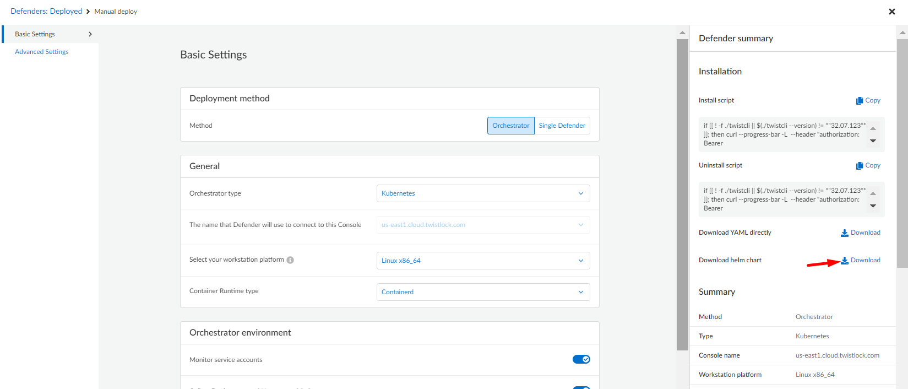

# Twistlock Defender Helm Chart
Helm Chart to deploy Twistlock Defender. 

This Chart can work with the CNCF approved [External Secrets Operator](https://external-secrets.io/latest) to manage it's internal secrets.

> **NOTE**
> * This Chart was tested using AWS Secrets Manager as External Secret Manager
> <br></br>

# Pre-requisites
## Download Helm Chart from Prisma Cloud
To get the required values for this Helm Chart to work download the Helm Chart from Prisma Cloud Compute Console by going to Manage > Defenders > Manual Deploy and Select the following paramaters:

- Deployment method: Orchestrator
- Orchestrator type: Kubernetes or Openshift

All other basic and advanced settings will vary depending on your environment. 

Once chosen the appropriate options for you, then Download the Helm Chart:


The file downloaded will be called **twistlock-defender-helm.tar.gz**. Inside of this compressed folder you need to extract the file **values.yaml** which will help as reference for the deployment.

## Handling External Secrets (optional)
To store the secrets related to the defender deployment in a External Secrets Managment system, use the following process:

### Install External Secrets Operator
Install the External Secrets Operator with the following commands
```bash
helm repo add external-secrets https://charts.external-secrets.io
helm install external-secrets external-secrets/external-secrets -n external-secrets --create-namespace
```
For more details regarding the installation, follow up the [getting started](https://external-secrets.io/latest/introduction/getting-started/) guide.

### Create a ClusterSecretStore or SecretStore
Follow up the corresponding [guide](https://external-secrets.io/latest/provider/aws-secrets-manager/) for installing a SecretStore or ClusterSecretStore so the External Secrets Operator can retrieve the secrets.

### Create a Secret
Create the Secret with the following JSON format:
```json
{
    "SERVICE_PARAMETER":"service_parameter",
    "DEFENDER_CA":"defender_ca_cert",
    "DEFENDER_CLIENT_CERT":"defender_client_cert",
    "DEFENDER_CLIENT_KEY":"defender_client_key",
    "ADMISSION_CERT":"admission_cert",
    "ADMISSION_KEY":"admission_key",
    "INSTALL_BUNDLE":"install_bundle",
    "WS_ADDRESS":"ws_address",
    "REGISTRY_USER":"registry.user",
    "REGISTRY_PASS":"registry.password",
    "REGISTRY":"registry.name"
}
```
You **must** substitute the values by the ones corresponding to your defender deployment. 

The values from SERVICE_PARAMETER until WS_ADDRESS are values that can be found in the values.yaml file of the helm chart downloaded from Prisma Cloud previously. 

If using the Defender Public Registry, the values for registry configuration should be the following:
- REGISTRY: registry.twistlock.com
- REGISTRY_USER: Any of your choice
- REGISTRY_PASS: The access token used to download the image

For more details regarding how to download the container images, follow [Prisma Cloud Container Images](https://docs.prismacloud.io/en/compute-edition/32/admin-guide/install/deploy-console/container-images) documentation.

# Installation
## Default Configuration
The default configuration is the following:
```yaml
collect_pod_labels: true          # Allows the Collection of Namespace an Deployment labels to be part of the labels detected in Prisma
monitor_service_accounts: true    # Allows the monitoring of the k8s service accounts
unique_hostname: true             # Assings unique hostnames
host_custom_compliance: false     # Disables de custome compliance of hosts
secret_store:                                 
  kind: ClusterSecretStore        # Use secret stores kind ClusterSecretStore
```
All other default settings can be found un the [values.yaml](https://github.com/PaloAltoNetworks/twistlock-defender-helm/blob/main/twistlock-defender/values.yaml) file.

## Values
### Installation without external secrets
Here is a simplest recommended sample of the **values.yaml** without external secrets:
```yaml
image_name: registry.twistlock.com/twistlock/defender:defender_<VERSION>
registry:
    name: registry.twistlock.com
    username: twistlock
    password: <ACCESS_TOKEN>
# Secrets
service_PARAMETER: <YOUR_SERVICE_PARAMETER>
defender_ca_cert: <YOUR_DEFENDER_CA>
defender_client_cert: <YOUR_DEFENDER_CERT>
defender_client_key: <YOUR_DEFENDER_KEY>
admission_cert: <YOUR_ADMISSION_CERT>
admission_key: <YOUR_ADMISSION_KEY> 
install_bundle: <YOUR_INSTALL_BUNDLE>
ws_address: <YOUR_WS_ADDRESS>
```

The value of the access token can be obtained in the image name when downloaded the helm chart. It should be the value next to *tw_*.

You can also substitute the image name and registry details if using a private registry.

### Installation with external secrets
Here is a simplest recommended sample of the **values.yaml** with external secrets:
```yaml
image_name: registry.twistlock.com/twistlock/defender:defender_<VERSION>
secret_store:
    name: <YOUR_SECRETSTORE_NAME>
    remote_key: <YOUR_SECRET_NAME>
```

### Including Admission Controller
To include the admission controller you must include the following values:
```yaml
defender_ca_cert: <YOUR_DEFENDER_CA>
admission_path: <YOUR_ADMISSION_PATH>
```
These values can be obtained from Prisma Compute Console by going to **Manage** > **Defenders** > **Settings**

## Installation Command
To install the latest version execute the following command:
```bash
helm upgrade --install -n twistlock -f values.yaml --create-namespace --repo https://paloaltonetworks.github.io/twistlock-defender-helm twistlock-defender twistlock-defender
```
To install an specific version execute the following command:
```bash
helm upgrade --install -n twistlock -f values.yaml --create-namespace --repo https://paloaltonetworks.github.io/twistlock-defender-helm --version <VERSION> twistlock-defender twistlock-defender
```
